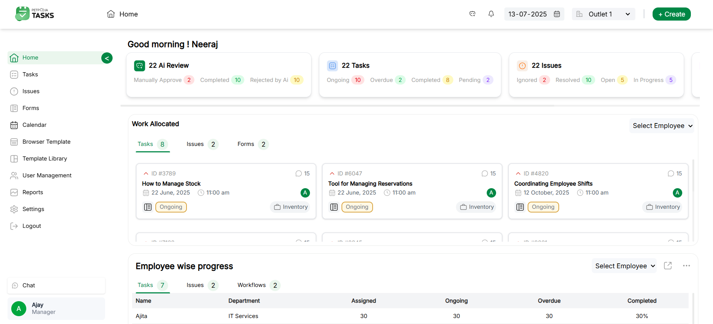
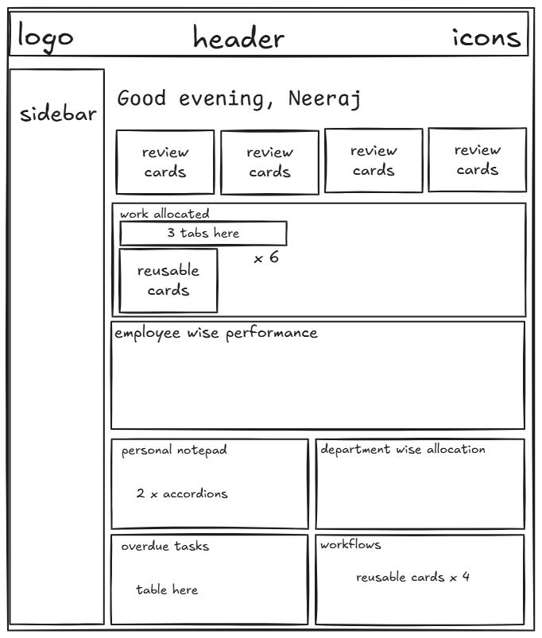

# Dashboard PetPooja

A responsive web dashboard built with React and Tailwind CSS, designed to visualize and manage key metrics and data for PetPooja. Includes user-friendly navigation, and modern UI components.



## 🗂️ Initial Layout Sketch (Excalidraw)

This is the initial wireframe sketched in Excalidraw to outline the structure and layout of the PetPooja dashboard before development. It helped plan the structure, component hierarchy and UI flow.



## 🔗 Live Demo

[View the Live Dashboard](https://dashboard-petpooja.netlify.app/)

---

## ✅ Prerequisites

- **Node.js** >= 18.x  
- **npm** >= 9.x

## 🚀 Instructions to Run

### 1. Clone the Repository

Clone the repository to your local machine using:

```bash
git clone https://github.com/neerajnishad5/dashboard-app.git
````
---

### 2. Install Dependencies

Navigate to the project directory:

```bash
cd dashboard-app
```

Install the required Node.js dependencies:

```bash
npm install
```

---

### 3. Start the Application

Run the development server:

```bash
npm run dev
```

Open your browser and visit [http://localhost:5173](http://localhost:5173) to view the application.


---

## 🛠️ List of Tools Used

* **React**: For building the user interface.
* **Tailwind CSS**: For styling and responsive design.
* **React Router**: For navigation between pages.
* **Vite**: For fast development and build tooling.
* **npm**: For package management.

---

### ⏱️ Time Taken

Approximately **16-20 hours**, including design, development, and responsive adjustments.

### 📬 Contact

For feedback, questions, or collaboration, reach out via email at [neerajnishad57@gmail.com](mailto:neerajnishad5@gmail.com) or open an issue in this repository.
